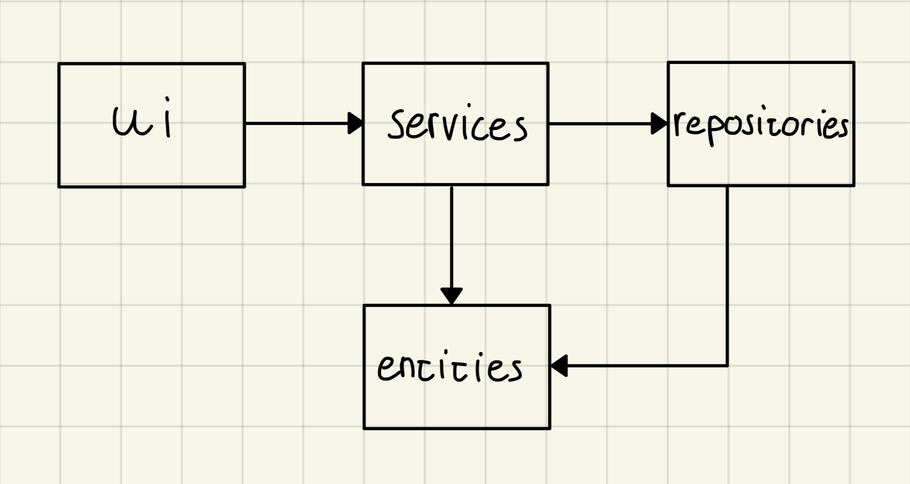
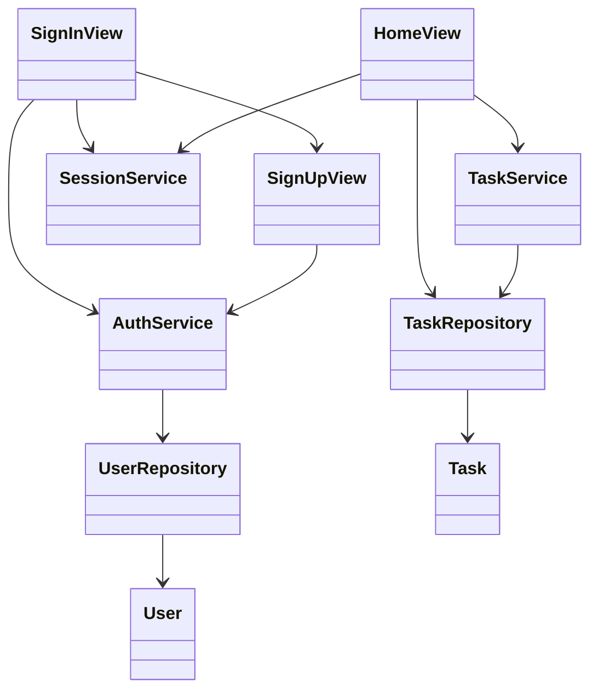
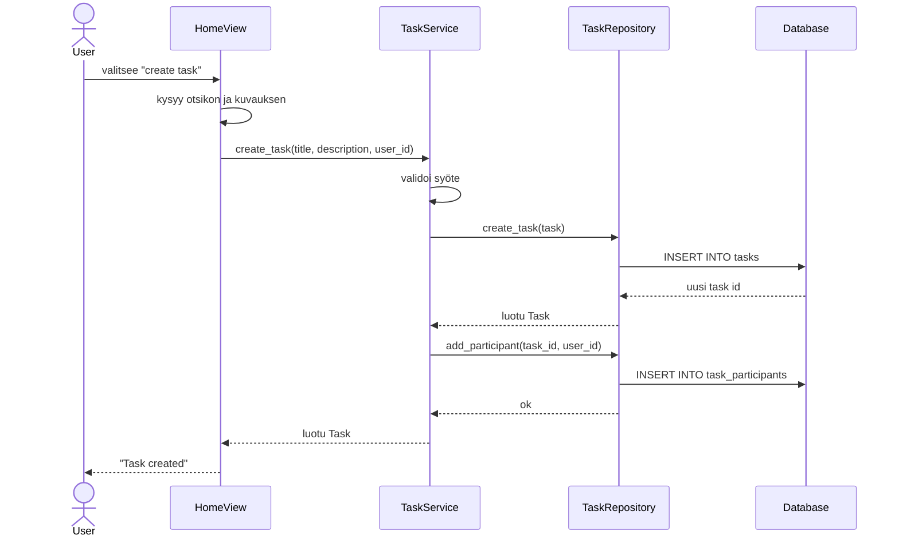

# Arkkitehtuuri

## Pakkausrakenne

Sovellus jakautuu kolmeen pääkerrokseen:

- `ui` käsittelee käyttäjän syötteet ja tulostuksen komentoriville
- `services` sisältää sovelluslogiikan ja syötteiden validoinnin
- `repositories` vastaa tietokantaan tallentamisesta ja hakemisesta

## Sekvenssikaavio: tehtävän luonti

