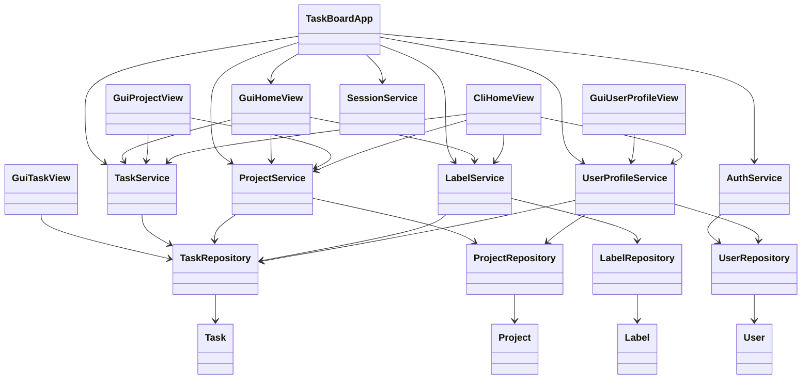
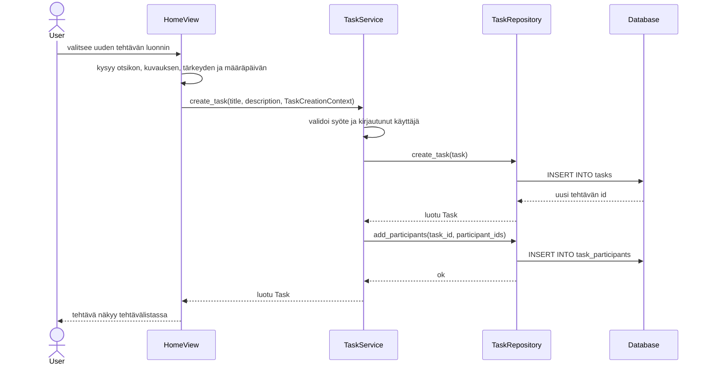
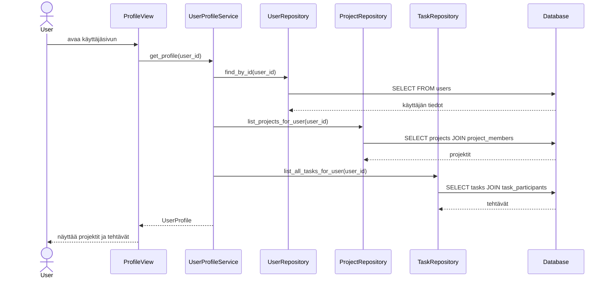

# Arkkitehtuuri

TaskBoard on kerrosarkkitehtuuria noudattava Python-sovellus. Sovelluksen ensisijainen käyttöliittymä on Tkinterillä toteutettu graafinen käyttöliittymä. Sen lisäksi sovelluksessa on vaihtoehtoinen komentorivikäyttöliittymä.

## Pakkausrakenne

Sovelluksen koodi on jaettu seuraaviin pakkauksiin:

- `gui`: Tkinter-käyttöliittymä
- `ui`: komentorivikäyttöliittymä
- `services`: sovelluslogiikka ja validointi
- `repositories`: SQLite-tietokannan käsittely
- `entities`: sovelluksen tietomallit

## Käyttöliittymäkerros

Graafinen käyttöliittymä sijaitsee `gui`-pakkauksessa. Sen pääluokka on `TaskBoardApp`, joka alustaa repositoriot ja palvelut sekä vaihtaa näkyvissä olevaa Tkinter-näkymää. Graafisen käyttöliittymän näkymiä ovat esimerkiksi kirjautumisnäkymä, kotinäkymä, projektinäkymä, tehtävänäkymä ja käyttäjäsivu.

Komentorivikäyttöliittymä sijaitsee `ui`-pakkauksessa. Se käyttää samoja service- ja repository-luokkia kuin graafinen käyttöliittymä. Tämän vuoksi molemmat käyttöliittymät käyttävät samaa sovelluslogiikkaa ja samaa tietokantaa.

Käyttöliittymäkerros ei vastaa pysyväistallennuksesta eikä varsinaisista liiketoimintasäännöistä. Se kerää käyttäjän syötteet, kutsuu service-luokkia ja näyttää tulokset käyttäjälle.

## Sovelluslogiikka

Kirjautumiseen ja rekisteröintiin liittyvä logiikka on `AuthService`-luokassa. Rekisteröinnissä tarkistetaan pakolliset kentät, sähköpostiosoitteen muoto, salasanan pituus, salasanan vahvistus ja sähköpostiosoitteen yksilöllisyys. Kirjautuneen käyttäjän tilaa ylläpitää `SessionService`.

Tehtäviin liittyvä logiikka on `TaskService`-luokassa. Palvelu vastaa tehtävän luonnin, muokkauksen, valmiiksi merkitsemisen, poistamisen ja haun validoinnista. Tehtävä voidaan luoda itsenäisenä tehtävänä tai projektin sisäisenä tehtävänä. Tehtävän näkyvyys perustuu `task_participants`-tauluun, eli käyttäjä näkee tehtävät, joissa hän on osallistujana.

Projektien hallinta on `ProjectService`-luokan vastuulla. Palvelu vastaa projektin luonnista, projektin tietojen hakemisesta, olemassa olevan tehtävän liittämisestä projektiin, projektin poistamisesta ja projektien hausta. Projektin luoja lisätään aina projektin jäseneksi. Projektin poistaminen on sallittu vain projektin luojalle.

Leimoihin liittyvä logiikka on `LabelService`-luokassa. Palvelu normalisoi leiman nimen, estää tyhjät ja päällekkäiset nimet sekä tarkistaa, että leima lisätään vain tehtävään, joka näkyy kirjautuneelle käyttäjälle.

Käyttäjäsivun tiedot kokoaa `UserProfileService`. Palvelu hakee käyttäjän perustiedot, projektit joissa käyttäjä on jäsenenä sekä tehtävät joissa käyttäjä on osallistujana. Käyttäjäsivua käytetään sekä oman sivun näyttämiseen että projektien ja tehtävien luojien tarkasteluun.

## Haku

Hakutoiminto on jaettu tehtävien ja projektien hakuun. `TaskService` välittää tehtävähakupyynnöt `TaskRepository`-luokalle, joka hakee käyttäjälle näkyviä tehtäviä otsikon ja kuvauksen perusteella. `ProjectService` välittää projektihakupyynnöt `ProjectRepository`-luokalle, joka hakee käyttäjän projektijäsenyyksien kautta näkyviä projekteja nimen perusteella.

Haku ei palauta muiden käyttäjien yksityisiä tehtäviä tai projekteja, vaan se käyttää samoja näkyvyysrajoja kuin tavallinen tehtävä- ja projektilistaus.

## Tietojen pysyväistallennus

Tietojen pysyväistallennus on toteutettu SQLite-tietokannalla. Tietokanta sijaitsee tiedostossa `data/taskboard.db`. Tietokanta alustetaan sovelluksen käynnistyessä `initialize_database`-funktion avulla. Sama funktio luo tarvittavat taulut ja lisää vanhoihin paikallisiin tietokantoihin puuttuvia sarakkeita.

Tietokannan keskeiset taulut ovat:

| Taulu | Tarkoitus |
| --- | --- |
| `users` | Rekisteröidyt käyttäjät |
| `tasks` | Tehtävät, niiden tila, tärkeys, määräpäivä ja mahdollinen projektiliitos |
| `projects` | Projektit |
| `labels` | Tehtäviin liitettävät leimat |
| `task_participants` | Käyttäjien osallistuminen tehtäviin |
| `project_members` | Käyttäjien jäsenyys projekteissa |
| `task_labels` | Tehtävien ja leimojen liitokset |

Tehtävien näkyvyys määräytyy `task_participants`-taulun perusteella. Projektien näkyvyys määräytyy `project_members`-taulun perusteella. Projektitehtävä jaetaan projektin jäsenille lisäämällä projektin jäsenet tehtävän osallistujiksi.

## Keskeiset tietomallit

Sovelluksen keskeiset entity-luokat ovat:

- `User`: käyttäjän nimi, sähköposti, salasanatiiviste ja tunniste
- `Task`: tehtävän otsikko, kuvaus, luoja, tärkeys, määräpäivä, tila ja projektiliitos
- `Project`: projektin nimi, luoja, tärkeys ja määräpäivä
- `Label`: leiman nimi

Entity-luokat ovat yksinkertaisia dataluokkia. Sovelluslogiikka sijaitsee service-luokissa eikä entity-luokissa.

## Sekvenssikaavio: tehtävän luonti

## Sekvenssikaavio: käyttäjäsivun näyttäminen

