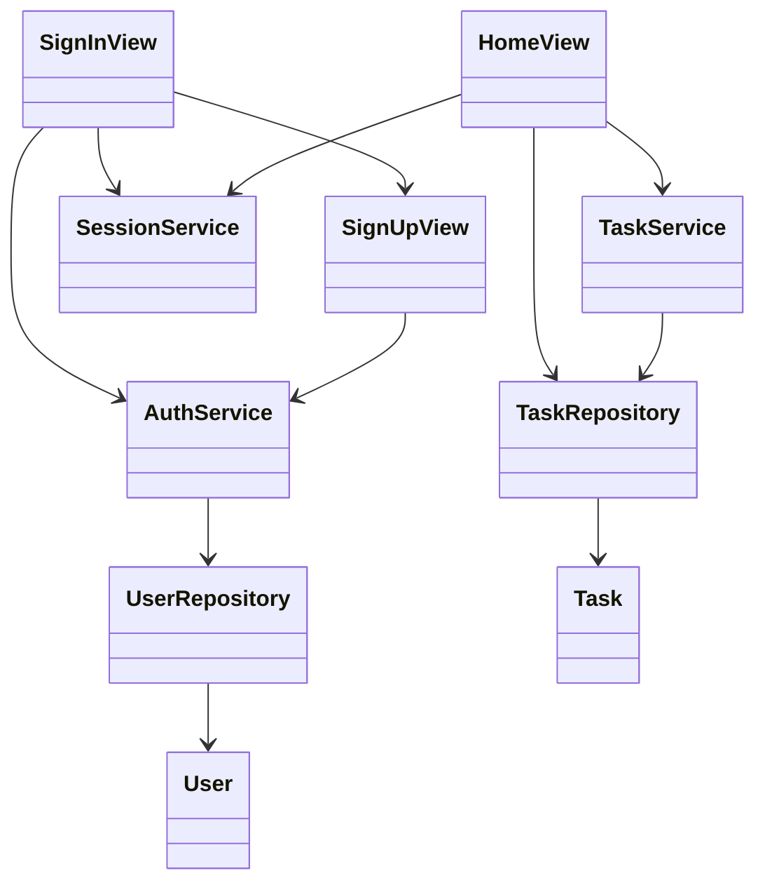
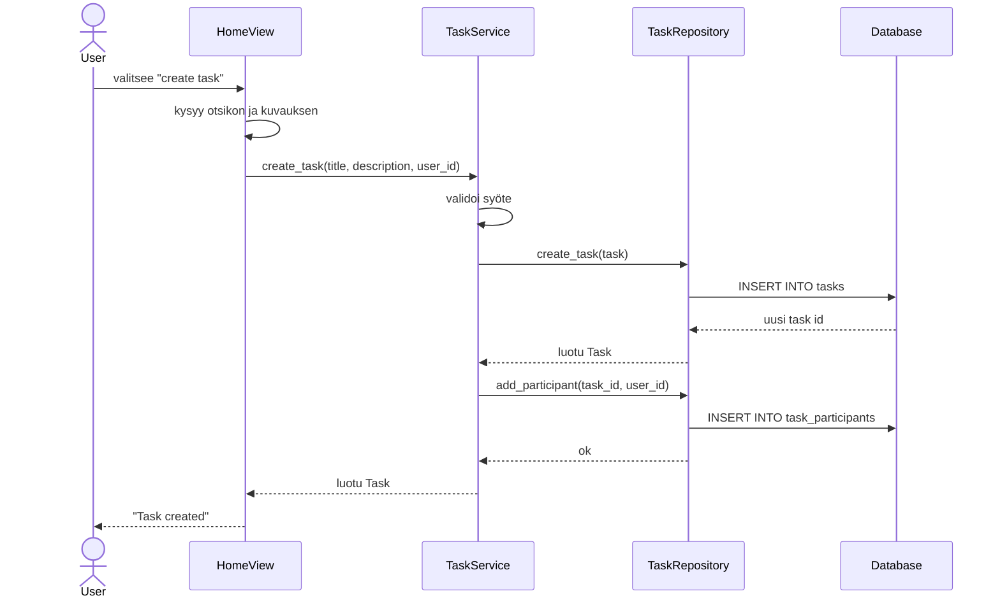

# Arkkitehtuuri

  ui-pakkaus sisältää komentorivikäyttöliittymästä vastaavan koodin. services sisältää
  sovelluslogiikan, kuten käyttäjien tunnistautumisen, projektien hallinnan ja tehtäviin
  liittyvät toiminnot. repositories vastaa tietojen pysyväistallennuksesta SQLite-tietokantaan.
  entities sisältää luokat, jotka kuvaavat sovelluksen keskeisiä tietokohteita, kuten käyttäjiä,
  tehtäviä ja projekteja.

## Pakkausrakenne

Sovellus jakautuu kolmeen pääkerrokseen:

- `ui` käsittelee käyttäjän syötteet ja tulostuksen komentoriville
- `services` sisältää sovelluslogiikan ja syötteiden validoinnin
- `repositories` vastaa tietokantaan tallentamisesta ja hakemisesta

## Sovelluslogiikka

Sovelluksen käyttö alkaa kirjautumisnäkymästä. Käyttäjä voi joko kirjautua sisään
olemassa olevalla käyttäjällä tai siirtyä rekisteröintiin kirjoittamalla `register`.
Kirjautumiseen ja rekisteröintiin liittyvä logiikka on `AuthService`-luokassa.
Onnistuneen kirjautumisen jälkeen `SessionService` pitää muistissa nykyisen käyttäjän
sovelluksen suorituksen ajan.

Tehtäviin liittyvä sovelluslogiikka on `TaskService`-luokassa. Se tarkistaa, että
tehtävän otsikko ja kuvaus on annettu, että käyttäjä on kirjautunut sisään sekä että
tärkeys ja määräpäivä ovat oikeassa muodossa. Tehtävät tallennetaan `TaskRepository`-
luokan kautta SQLite-tietokantaan. Tehtävä voidaan luoda normaalina käyttäjän omana
tehtävänä tai projektin sisäisenä tehtävänä.

Projektien hallinta on `ProjectService`-luokan vastuulla. Projektia luotaessa palvelu
tarkistaa projektin nimen, tärkeyden ja määräpäivän sekä lisää projektin luojan
automaattisesti projektin jäseneksi. Projektiin voidaan lisätä muita käyttäjiä,
luoda uusia projektitehtäviä ja liittää olemassa olevia tehtäviä. Projektin voi poistaa
vain projektin luonut käyttäjä. Poisto ei poista tehtäviä, vaan irrottaa ne projektista.

Leimoihin liittyvä logiikka on `LabelService`-luokassa. Palvelu vastaa leiman nimen
normalisoinnista, tyhjien nimien hylkäämisestä ja duplikaattien estämisestä. Leima
voidaan liittää vain sellaiseen tehtävään, joka näkyy kirjautuneelle käyttäjälle.
Leimojen hakua varten repository-kerroksessa on valmiina metodi, jota voidaan hyödyntää
myöhemmässä hakutoiminnossa.

Tietojen pysyväistallennus on toteutettu SQLite-tietokannalla. Tietokanta alustetaan
sovelluksen käynnistyksen yhteydessä `initialize_database`-funktion avulla. Sama
funktio lisää tarvittaessa puuttuvat sarakkeet vanhaan tietokantaan, jotta aiemmin
luotu paikallinen tietokanta toimii myös uusien ominaisuuksien kanssa.

## Sekvenssikaavio: tehtävän luonti

